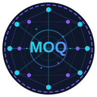

<p align="center">
  
</p>

<p align="center">
  <a href="https://github.com/Quicr/moq-web/actions/workflows/ci.yml"></a>
  <a href="https://github.com/Quicr/moq-web/actions/workflows/deploy.yml"></a>
</p>

# MOQ Web

A browser-based implementation of Media over QUIC Transport (MOQT) for real-time media streaming.
Built on WebTransport and WebCodecs for low-latency video/audio delivery.

## Quick Start

1. **Install pnpm** (if not installed):
   ```bash
   npm install -g pnpm
   ```

2. **Install dependencies**:
   ```bash
   pnpm install
   ```

3. **Generate certificates** for local WebTransport:
   ```bash
   ./scripts/create_server_cert.sh
   ```

4. **Build and run**:
   ```bash
   pnpm build
   pnpm dev
   ```

5. Open https://localhost:5173

> **Note:** You need a MOQT relay server to connect to. Enable "Local Development" in settings to use self-signed certificates.

## Protocol Support

| Draft | Status | Notes |
|-------|--------|-------|
| Draft-14 | Default | Full support |
| Draft-15 | Included with Draft-16 | ALPN negotiation |
| Draft-16 | Build-time flag | Full support |

Build for draft-16:

```bash
pnpm build:draft-16
pnpm dev:draft-16
```

## Architecture

```
┌─────────────────────────────────────────┐
│              Browser                     │
│  ┌───────────────────────────────────┐  │
│  │         @web-moq/client           │  │
│  │        (React UI App)             │  │
│  └─────────────┬─────────────────────┘  │
│                │                         │
│  ┌─────────────▼─────────────────────┐  │
│  │         @web-moq/media            │  │
│  │   (WebCodecs, LOC, Pipelines)     │  │
│  └─────────────┬─────────────────────┘  │
│                │                         │
│  ┌─────────────▼─────────────────────┐  │
│  │        @web-moq/session           │  │
│  │    (Protocol, Subscriptions)      │  │
│  └─────────────┬─────────────────────┘  │
│                │                         │
│  ┌─────────────▼─────────────────────┐  │
│  │         @web-moq/core             │  │
│  │   (Types, Codecs, Transport)      │  │
│  └───────────────────────────────────┘  │
└──────────────────┬──────────────────────┘
                   │ WebTransport
                   ▼
            ┌────────────┐
            │ MOQT Relay │
            └────────────┘
```

For detailed design documentation, see [docs/design.md](docs/design.md).

## Project Structure

```
packages/
├── core       # Protocol types, encoding, state machines, transport
├── session    # MOQT session management, subscriptions, publications
├── media      # WebCodecs, LOC container, media pipelines
└── client     # React web application
```

## Prerequisites

- Node.js 20+
- pnpm (`npm install -g pnpm`)

## Test

```bash
pnpm test              # Run all tests
pnpm test:draft-16     # Test with draft-16
```

## License

This project is licensed under [BSD-2-Clause](LICENSE).
